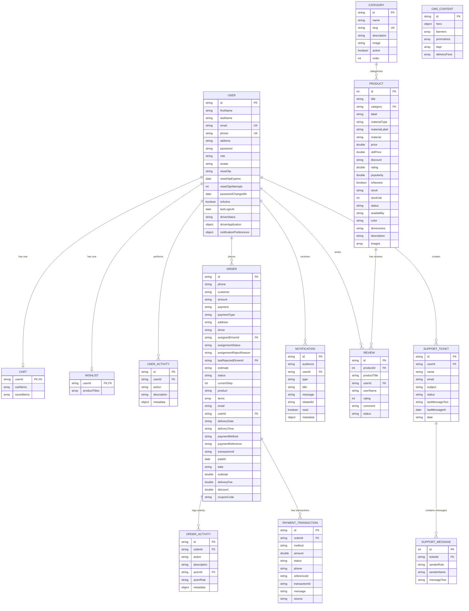

# E-Commerce Database Schema Documentation

Halkan waxaa ku qoran shaxda (schema diagram) iyo sharaxaadda database-kaaga oo ku dhisan **MongoDB** iyo **Mongoose**. Database-kani wuxuu ka kooban yahay 14 collections oo kala duwan kuwaas oo maamula macmiisha, alaabta, dalabaadka, kaararka adeegga, tigidhada caawinta, iyo maamulka guud ee websaydhka.

---

## Database Entity Relationship Diagram (ERD)

Jaantuskani wuxuu muujinayaa xiriirka ka dhexeeya collections-ka kala duwan ee database-kaaga:

---

## Faahfaahinta Collections-ka (Detailed Collection Breakdown)

### 1. User (`User.js`)
Waxay kaydisaa macluumaadka dadka isticmaala websaydhka sida (Macaamiisha, Admins-ka, iyo Darawallada gaarsiinta dalabaadka).
*   **id (String - PK, Unique, Index):** Aqoonsiga gaarka ah ee user kasta.
*   **firstName / lastName (String):** Magaca koowaad iyo labaad ee isticmaalaha.
*   **email (String - Unique):** Ciwaanka iimaylka ee isticmaalaha.
*   **phone (String - Unique):** Lambarka taleefanka isticmaalaha.
*   **address (String):** Ciwaanka (Default: Mogadishu, Somalia).
*   **role (String):** Doorka isticmaalaha (`user`, `admin`, `delivery`).
*   **driverApplication (Object):** Faahfaahinta codsiga darawalnimada (District, status, rejectReason, vehicleType, iwm.).
*   **driverStatus (String):** Heerka darawalka (`available`, `busy`, `offline`).
*   **notificationPreferences (Object):** Habaynta ogeysiisyada (Email, SMS, Push alerts).

### 2. Product (`Product.js`)
Waxay kaydisaa macluumaadka alaabta la iibinayo.
*   **id (Number - PK, Unique, Index):** Aqoonsiga gaarka ah ee alaabta (Auto-incremented).
*   **title (String):** Magaca alaabta.
*   **category (String):** Qaybta ay alaabtu ka tirsan tahay (e.g., Furniture, Sofa).
*   **price (Number) / oldPrice (Number):** Qiimaha hadda iyo qiimihii hore ee alaabta.
*   **discount (String):** Boqolkiiba inta la dhimay (e.g., "15%").
*   **stockVal (Number):** Inta xabbo oo bakhaarka ku hartay.
*   **images (Array of Strings):** Sawirrada alaabta.
*   **rating (Number):** Celceliska dhibcaha qiimaynta (1 ilaa 5).

### 3. Category (`Category.js`)
Waxay kaydisaa qaybaha kala duwan ee alaabta loo kala saaro.
*   **id (String - PK, Unique, Index):** Aqoonsiga qaybta.
*   **name (String):** Magaca qaybta (e.g., Sofa, Chairs).
*   **slug (String - Unique):** URL-saaxiibtinimo ee qaybta (e.g., `modern-sofas`).
*   **active (Boolean):** Haddii ay qaybtani firfircoon tahay iyo haddii kale.
*   **order (Number):** Kala-sarreynta qaybaha marka la soo bandhigayo.

### 4. Order (`Order.js`)
Waxay kaydisaa dalabaadka macaamiishu sameeyeen iyo heerarkooda kala duwan.
*   **id (String - PK, Unique, Index):** Aqoonsiga dalabka.
*   **userId (String - FK, Index):** Isticmaalaha dalabka iska leh.
*   **customer / phone / address (String):** Faahfaahinta macmiilka dalabka sameeyey.
*   **amount (String):** Lacagta guud ee dalabka.
*   **status (String):** Heerka uu dalabku marayo (`processing`, `shipped`, `delivered`, `cancelled`).
*   **assignedDriverId (String - FK, Index):** Darawalka loo xilsaaray inuu geeyo dalabka.
*   **assignmentStatus (String):** Aqbalaadda darawalka (`none`, `pending`, `accepted`, `rejected`).
*   **items (Array):** Liiska alaabta la dalbaday (id, title, price, quantity, iwm.).
*   **subtotal / deliveryFee / discount (Number):** Cadadka kala duwan ee xisaabta dalabka.

### 5. OrderActivity (`OrderActivity.js`)
Waxay kaydisaa taariikhda iyo waxqabadka dhacay inta uu dalabku socdo (Audit Log).
*   **id (String - PK, Unique, Index):** Aqoonsiga activity-ga.
*   **orderId (String - FK, Index):** Dalabka lala xiriiriyay.
*   **action (String):** Waxqabadka dhacay (e.g., `order_placed`, `driver_assigned`, `status_changed`, iwm.).
*   **actorId / actorRole (String):** Qofka ficilka sameeyey iyo doorkiisa.

### 6. Cart (`Cart.js`)
Waxay kaydisaa alaabta macmiilku ku darsaday dorgaha (Shopping Cart) iyo kuwa uu hadhow dhigtay (Saved items).
*   **userId (String - PK, Unique, Index):** Isticmaalaha iska leh kaarka.
*   **cartItems / savedItems (Array):** Alaabaha ku jira kaarka (title, price, quantity, image, iwm.).

### 7. Wishlist (`Wishlist.js`)
Waxay kaydisaa alaabta macmiilku calaamadsaday si uu hadhow u iibsado.
*   **userId (String - PK, Unique, Index):** Isticmaalaha iska leh liiska.
*   **productTitles (Array of Strings):** Magacyada alaabaha la calaamadsaday.

### 8. Review (`Review.js`)
Qiimaynta iyo faallooyinka macaamiishu ka bixiyaan alaabada ay iibsadeen.
*   **id (String - PK, Unique, Index):** Aqoonsiga faallada.
*   **productId (Number - FK, Index):** Alaabta la qiimeeyey.
*   **userId (String - FK):** Qofka qiimeeyey.
*   **rating (Number):** Dhibcaha (1-5).
*   **status (String):** Heerka faallada (`pending`, `approved`, `rejected`).

### 9. PaymentTransaction (`PaymentTransaction.js`)
Xogta lacag-bixinta ee la xiriirta dalabaadka (sida EVC Plus, Premier Wallet, iwm.).
*   **id (String - PK, Unique, Index):** Aqoonsiga lacag-bixinta.
*   **orderId (String - FK, Index):** Dalabka lacagta laga bixiyey.
*   **amount (Number):** Cadadka lacagta.
*   **status (String):** Natiijada lacag-bixinta (`pending`, `success`, `failed`).
*   **transactionId (String):** Aqoonsiga shirkadda lacagta bixisay (Reference ID).

### 10. SupportTicket / SupportMessage (`SupportTicket.js` & `SupportMessage.js`)
Nidaamka wada-hadalka iyo taageerada macaamiisha (Customer Support System).
*   **SupportTicket:** Waxay kaydisaa mawduuca guud ee cabashada iyo heerkeeda (`Open`, `Replied`, `Closed`).
*   **SupportMessage:** Wada-hadallada hoose ee dhexmara macmiilka iyo Admin-ka ee ku aaddan ticket gaar ah (`ticketId`).

### 11. Notification (`Notification.js`)
Ogeysiisyada loo diro macaamiisha ama maamulayaasha.
*   **audience (String):** Dadka loo wado ogeysiiska (`user` ama `admin`).
*   **userId (String - FK):** Isticmaalaha loo dirayo (haddii uu yahay qof gaar ah).
*   **read (Boolean):** Haddii la akhriyey iyo haddii kale.

### 12. UserActivity (`UserActivity.js`)
Diiwaanka dhaqdhaqaaqa user-ka (sida goorta uu isdiiwaangaliyey, soo galay, badalay profile-ka, iwm.).
*   **userId (String - FK, Index):** Isticmaalaha sameeyey dhaqdhaqaaqa.
*   **action (String):** Ficilka uu sameeyey (`register`, `login`, `profile_update`, iwm.).

### 13. CmsContent (`CmsContent.js`)
Waxay kaydisaa content-ka guud ee bogga hore (Landing page), xayaysiisyada (Banners), qiimo-dhimista (Promotions), su'aalaha badanaa la isweydiiyo (FAQs), iyo khidmadaha gaarsiinta degmooyinka Muqdisho (Delivery Fees).
*   **hero (Object):** Qoraalka iyo sawirka weyn ee bogga hore.
*   **deliveryFees (Array):** Liiska degmooyinka iyo qiimaha gaarsiinta (e.g. district, fee).
