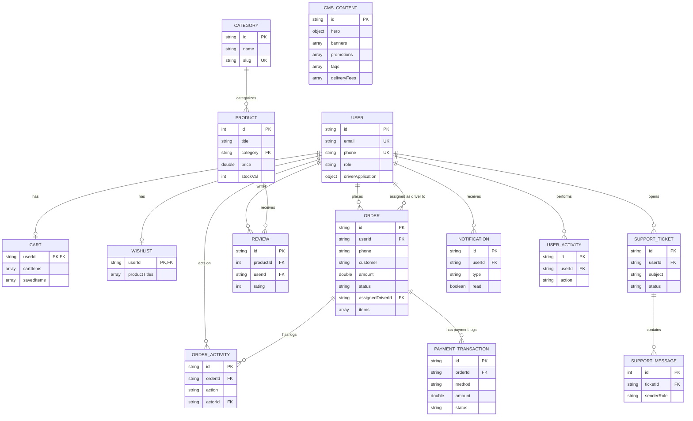

# E-Commerce Database Schema (Thesis & Presentation Version)

Halkan waxaa ku qoran shaxda database-kaaga oo loogu talagalay **Chapter 3** ee buugga qalin-jabinta (Thesis) iyo in aad u soo bandhigtid guddiga imtixaanka (Defense Panel). 

Jaantuskan wuxuu si sax ah u muujinayaa **dhammaan 14-ka collections** ee dhabta ah ee ku jira database-kaaga MongoDB (sida ay ugu kala qoran yihiin faylasha `backend/models`). Waxaa laga saaray jadwalkii dheeriga ahaa ee SQL-ka u ekaa (sida Driver, Payment Method, iyo Order Item oo MongoDB dhexdiisa ku ah Arrays ku dhex jira collections kale).

---

## Jaantuska Xiriirka Database-ka (Thesis ERD - 14 Collections)

Koodhkan hoose waa kan saxda ah ee aad koobiyeysan karto si aad sawir ahaan ugu badasho:

---

## Sharaxaadda Connections-ka saxda ah (Correct Relationships)

Waa kuwan xiriirada saxda ah ee waafaqsan MongoDB-gaaga si aad ugu sharaxdo guddiga:

1. **USER iyo collections-ka ku xiran:**
   * **CART & WISHLIST (1:1):** Isticmaale kasta wuxuu leeyahay hal doobad (`CART`) iyo hal liis oo uu wax ku calaamadsado (`WISHLIST`). Labaduba waxay isticmaalaan `userId` si ay ula xiriiraan USER.
   * **ORDER (1:N):** Macmiilku wuxuu samayn karaa dhowr dalab (`userId`). Sidoo kale, darawalku wuxuu u xilsaaran karaa dhowr dalab (`assignedDriverId`).
   * **REVIEW, NOTIFICATION, USER_ACTIVITY (1:N):** Dhammaantood waxay si toos ah ugu xiran yihiin `USER` iyagoo isticmaalaya furaha `userId`.

2. **PRODUCT iyo collections-ka ku xiran:**
   * **CATEGORY iyo PRODUCT (1:N):** Alaab kasta waxay ka tirsan tahay hal qayb iyadoo adeegsanaysa furaha `category` oo xiriir la leh `slug` ama `id` ee Category.
   * **PRODUCT iyo REVIEW (1:N):** Alaab kasta waxay heli kartaa faallooyin iyo qiimayn dhowr ah (`productId`).

3. **ORDER iyo collections-ka ku xiran:**
   * **PAYMENT_TRANSACTION (1:N):** Hal dalab wuxuu yeelan karaa hal ama dhowr isku day oo lacag-bixineed (`orderId`).
   * **ORDER_ACTIVITY (1:N):** Dalab kasta wuxuu leeyahay taariikh logs ah oo muujinaya goorta la diray, la aqbalay, ama la geeyay (`orderId`).

4. **SUPPORT_TICKET iyo SUPPORT_MESSAGE (1:N):**
   * Cabasho kasta oo la furo (`SUPPORT_TICKET`) waxay ka koobnaan kartaa dhowr farriimood oo wada-hadal ah (`SUPPORT_MESSAGE`) oo adeegsanaya furaha `ticketId`.

5. **CMS_CONTENT (Standalone):**
   * Collection-kani waa mid madax-bannaan oo kaydiya content-ka guud ee bogga (Promotions, FAQs, Banners, iyo Delivery Fees) isagoo isticmaalaya arrays ku dhex jira halkii uu collections kale u kala jabin lahaa.

---

## Sida loo soo dejisto Sawirka Jaantuska (How to Export as PNG/SVG)

Si aad ugu darto buuggaaga (Word/PDF):
1. Nuqul ka qaad (Copy) koodka sare ee ku dhex jira sanduuqa **`mermaid`**.
2. Tag mareegta: **[mermaid.live](https://mermaid.live)**.
3. Dhinaca bidix ku dheji (Paste) koodhka aad koobiyaysay.
4. Dhinaca midig wuxuu si toos ah ugu soo saari doonaa jaantuska.
5. Guji badhanka **"Actions"** ee hoose ee bidixda, dabadeed dooro **"Download PNG"** si aad u soo dejisato.
6. Sawirkaas ku dhex dheji **Chapter 3**-kaaga.
