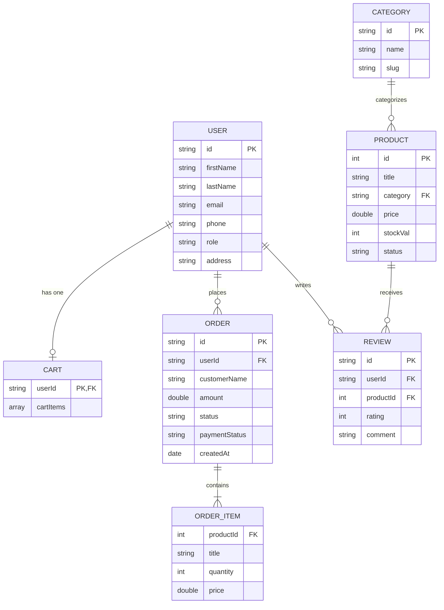

# E-Commerce Database Schema (Simplified Version)

Halkan waxaa ku qoran jaantus database oo aad u fudud oo ku habboon in aad ku darto **Chapter 3** ee buuggaaga qalin-jabinta, aadna ugu sharaxdo guddiga imtixaanka (defense panel). Waxay ka kooban tahay oo kaliya 6-da qaybood ee ugu muhiimsan (Core Entities).

---

## Jaantuska Xiriirka Database-ka (Simplified ERD)

Koodhkan hoose waa kan aad koobiyeysan karto si aad sawir ahaan ugu badasho (fiiri tilmaamaha hoose):

---

## Sidee loo sharaxaa Jaantuskan (How to explain to the Panel)?

Marka aad hortaagan tahay guddiga (Panel-ka), waxaad ugu sharxi kartaa si fudud adoo tilmaamaya xiriirada (Relationships):

1. **USER iyo CART (1:1 - One-to-One):** 
   * *Sharaxaad:* Isticmaale kasta (`USER`) wuxuu leeyahay hal doobad/kart (`CART`) oo uu alaabta ku dhex kaydsado inta uusan iibsan.

2. **USER iyo ORDER (1:N - One-to-Many):**
   * *Sharaxaad:* Hal macmiil (`USER`) wuxuu samayn karaa dhowr dalab (`ORDER`) oo kala duwan muddo ka duwan.

3. **USER iyo REVIEW (1:N - One-to-Many):**
   * *Sharaxaad:* Hal macmiil (`USER`) wuxuu qori karaa dhowr qiimayn (`REVIEW`) oo ku saabsan alaabaha uu iibsaday.

4. **CATEGORY iyo PRODUCT (1:N - One-to-Many):**
   * *Sharaxaad:* Hal qayb (sida *Sofa* ama *Chairs*) waxaa ku jiri kara dhowr alaabood (`PRODUCT`) oo ka tirsan qaybtaas.

5. **PRODUCT iyo REVIEW (1:N - One-to-Many):**
   * *Sharaxaad:* Hal alaab ah (`PRODUCT`) waxay heli kartaa dhowr qiimayn/faallo (`REVIEW`) oo ka yimid macaamiil kala duwan.

6. **ORDER iyo ORDER_ITEM (1:N - One-to-Many):**
   * *Sharaxaad:* Hal dalab (`ORDER`) wuxuu ka koobnaan karaa dhowr shay oo la dalbaday (`ORDER_ITEM`).

---

## Sida loo soo dejisto Sawirka Jaantuska (How to Export as PNG/SVG)

Si aad ugu darto buuggaaga (Word/PDF):
1. Nuqul ka qaad (Copy) koodka sare ee ku dhex jira sanduuqa **`mermaid`**.
2. Tag mareegta: **[mermaid.live](https://mermaid.live)** (Waa bilaash).
3. Dhinaca bidix ku dheji (Paste) koodhka aad koobiyaysay.
4. Dhinaca midig wuxuu si toos ah ugu soo saari doonaa jaantuska isagoo sawir ah.
5. Guji badhanka **"Actions"** ee hoose ee bidixda, dabadeed dooro **"Download PNG"** ama **"Download SVG"** si aad kombuyutarkaaga ugu soo dejisato.
6. Sawirkaas ku dhex dheji (Insert Picture) **Chapter 3**-kaaga ee Microsoft Word ama LaTeX.
