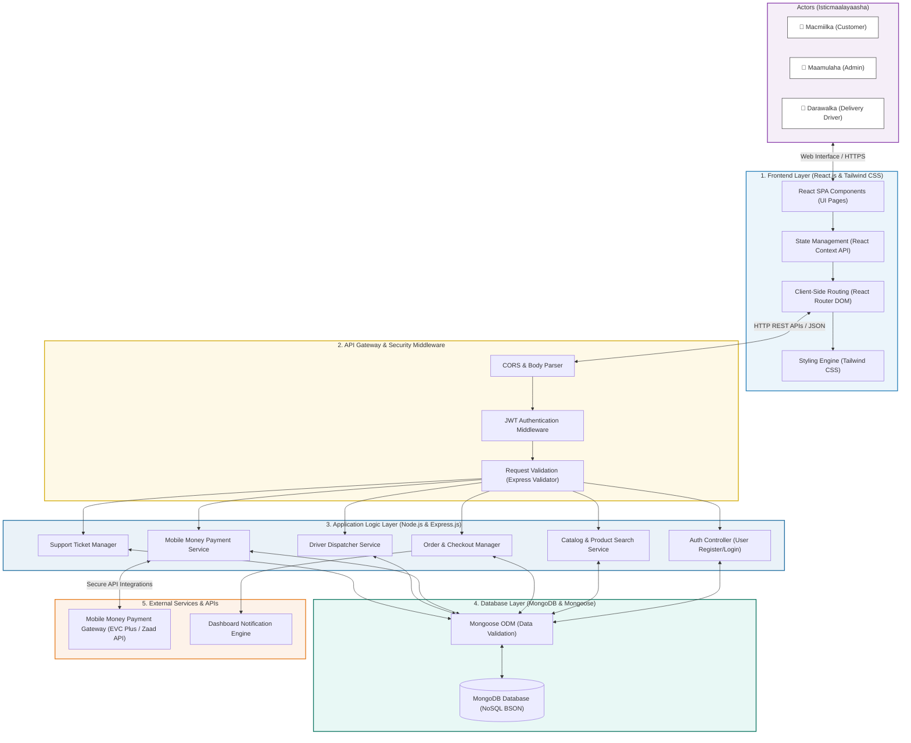

# Advanced System Architecture Diagram

Halkan waxaa ku qoran jaantus ka sii casrisan oo aad u faahfaahsan (Advanced System Architecture Diagram) kaas oo si buuxda u muujinaya lakabyada amniga (Security), habaynta koodhka (React State & Routing), maamulka controllers-ka backend-ka, iyo isku-xirka database-ka iyo adeegyada dibadda. 

---

## Jaantuska Dhismaha Nidaamka ee Casriga ah (Advanced ERD/Flow)

Koodhkan hoose waa kan aad koobiyeysan karto si aad sawir ahaan ugu badasho (fiiri tilmaamaha hoose):

---

## Sidee Guddiga loogu sharxaa (How to explain to the Panel)?

Jaantuskan wuxuu u qaybsan yahay **5 Lakab (Layers)** oo mid kasta uu leeyahay hawl gaar ah:

1. **Actors (Isticmaalayaasha):** Nidaamka waxaa isticmaala 3 qof oo kala ah: Macmiilka (adeeganaya), Maamulaha (maamulaya alaabta iyo dalabaadka), iyo Darawalka (geynaya alaabta).
2. **Frontend Layer (React & Tailwind):** Waa qaybta uu user-ku arko. React wuxuu maamulaa state-ka iyo isu-gudubka bogagga (Routing), halka Tailwind CSS uu maamulo bilicda.
3. **API Gateway & Security:** Kahor inta aan la gaarin backend-ka, koodhku wuxuu maraa amniga:
   * **CORS:** Si loo hubiyo amniga domains-ka soo xiriiraya.
   * **JWT Authentication:** Si loo hubiyo in qofka soo galaya uu yahay qof sax ah oo nidaamka ka diiwaangashan.
   * **Request Validation:** Si loo xaqiijiyo in xogta la soo diray ay sax tahay (Codsiyada khaldan halkaas ayaa lagu reebaa).
4. **Application Logic Layer (Node/Express):** Waa maskaxda nidaamka (Controllers) oo maamusha isdiiwaangalinta, raadinta alaabta, dalabaadka, lacag-bixinta, darawal-u-xilsaarista, iyo tigidada caawinta.
5. **Database Layer (MongoDB/Mongoose):** Waa halka ay xogtu ku kaydsan tahay qaab NoSQL ah.
6. **External Services (Payment & SMS):** Isku-xirka APIs-ka shirkadaha isgaarsiinta ee lacagaha (sida EVC Plus) iyo dirista ogeysiisyada dashboard-ka.

---

## Sida loo soo dejisto Sawirka Jaantuska

Si aad ugu darto buuggaaga (Word/PDF):
1. Nuqul ka qaad (Copy) koodka sare ee ku dhex jira sanduuqa **`mermaid`**.
2. Tag mareegta: **[mermaid.live](https://mermaid.live)**.
3. Dhinaca bidix ku dheji (Paste) koodhka aad koobiyaysay.
4. Jaantuska wuxuu si toos ah sawir ahaan ugu soo baxayaa dhinaca midig.
5. Guji badhanka **"Actions"** ee hoose, dabadeed dooro **"Download PNG"** si aad u soo dejisato.
6. Sawirkaas ku dhex dheji **Chapter 3**-kaaga.
