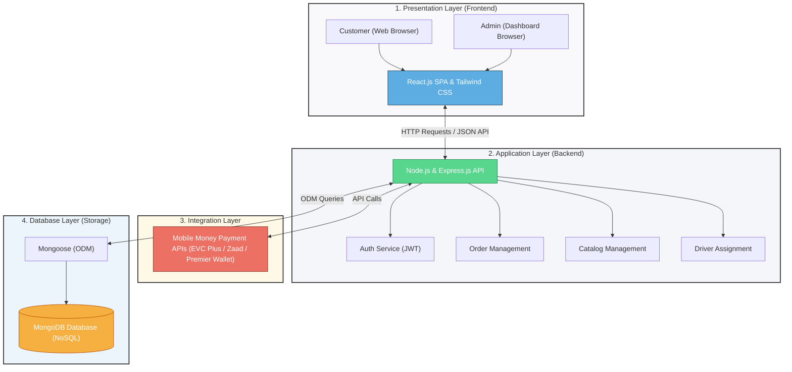

# Figure 3.1: System Architecture Diagram

Halkan waxaa ku qoran koodhka jaantuska dhismaha nidaamkaaga (**System Architecture Diagram**) oo si sax ah u qeexaya 4-ta lakab (layers) ee uu nidaamkaagu ka kooban yahay:

---

## Jaantuska Dhismaha Nidaamka (System Architecture Diagram)

Koodhkan hoose waa kan aad koobiyeysan karto si aad sawir ahaan ugu badasho (fiiri tilmaamaha hoose):

---

## Sharaxaadda 4-ta Lakab (Explaining the Layers to the Panel)

Marka aad sharaxayso jaantuskan, waxaad u dhigi kartaa sidan:

1. **Presentation Layer (Lakabka Bandhiga):** Waa qaybta hore (Frontend) ee uu macmiilku ama maamuluhu (Admin) ku arko shabakada. Waxaa lagu dhisay **React.js** iyo **Tailwind CSS**.
2. **Application Layer (Lakabka Adeegga):** Waa Server-ka dhexe oo ku dhisan **Node.js** iyo **Express.js**. Wuxuu maamulaa xaqiijinta dadka soo gelaya (Auth), dalabaadka (Orders), alaabta (Catalog), iyo darawallada dalabka qaadaya (Delivery).
3. **Database Layer (Lakabka Kaydka):** Waa database-ka **MongoDB** (NoSQL) oo xogta oo dhan kaydiya, waxaana la adeegsadaa **Mongoose** si koodhka backend-ka loogu xiro database-ka.
4. **Integration Layer (Lakabka Isku-xirka):** Waa qaybta lagu xiro adeegyada dibadda sida shirkadaha lacagta (Mobile Money APIs) si macaamiishu si toos ah lacagta ugu bixiyaan taleefankooda (sida EVC Plus).

---

## Sida loo soo dejisto Sawirka Jaantuska (How to Export as PNG/SVG)

Si aad ugu darto buuggaaga (Word/PDF):
1. Nuqul ka qaad (Copy) koodka sare ee ku dhex jira sanduuqa **`mermaid`**.
2. Tag mareegta: **[mermaid.live](https://mermaid.live)**.
3. Dhinaca bidix ku dheji (Paste) koodhka aad koobiyaysay.
4. Jaantuska wuxuu si toos ah sawir ahaan ugu soo baxayaa dhinaca midig.
5. Guji badhanka **"Actions"** ee hoose ee bidixda, dabadeed dooro **"Download PNG"** si aad u soo dejisato.
6. Sawirkaas ku dhex dheji **Chapter 3**-kaaga hoostiisa **Figure 3.1: System Architecture Diagram**.
